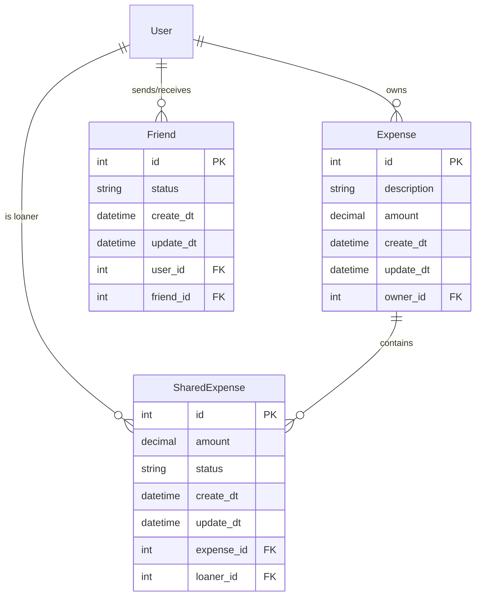

# Budgeter v2

A full-stack personal finance application for tracking expenses, splitting costs with friends, and managing shared budgets. Built with **Django REST Framework** and **React (Vite + Shadcn UI)**.

---

## Tech Stack

| Layer       | Technology                                             |
|-------------|--------------------------------------------------------|
| **Backend** | Django 4.1, Django REST Framework 3.14, Python 3.11    |
| **Frontend**| React 18, Vite, Tailwind CSS, Shadcn UI, Zustand       |
| **Database**| PostgreSQL (NeonDB) — SQLite fallback for local dev     |
| **Infra**   | Docker Compose, Nginx-ready                            |

---

## Getting Started

### Prerequisites
- Docker & Docker Compose
- A NeonDB account (or any PostgreSQL instance)

### 1. Clone & Configure

```bash
git clone <repo-url>
cd Budgeter_v2
```

Copy the example env file and fill in your values:

```bash
cp backend/.env.example backend/.env
```

**`backend/.env`**:
```env
SECRET_KEY=<your-django-secret-key>
DEBUG=True
FRONTEND_IP=localhost
DATABASE_URL=postgres://<user>:<password>@<host>:<port>/<dbname>?sslmode=require
```

### 2. Run with Docker Compose

```bash
docker compose up --build
```

| Service  | URL                     |
|----------|-------------------------|
| Frontend | http://localhost:5173    |
| Backend  | http://localhost:8000    |

Migrations run automatically on container startup.

### 3. Create a Superuser (optional)

```bash
docker compose exec backend python manage.py createsuperuser
```

---

## Project Structure

```
Budgeter_v2/
├── backend/
│   ├── api/            # Auth views (Login, Signup, Logout)
│   ├── expense/        # Expense & SharedExpense CRUD
│   ├── friend/         # Friend requests & discovery
│   ├── user/           # User profile & settings
│   ├── service/        # Django project settings, URLs, mixins
│   ├── Dockerfile
│   └── requirements.txt
├── frontend/
│   ├── src/
│   │   ├── components/ # Shadcn UI components, ExpenseTable, Navbar
│   │   ├── pages/      # Home, Landing, Friends, Settings
│   │   └── stores/     # Zustand state management
│   └── package.json
└── docker-compose.yml
```

---

## API Reference

**Base URL**: `http://localhost:8000/api/`

All endpoints (except Auth) require **Session Authentication**. Include cookies in requests.

---

### Authentication

| Method | Endpoint           | Auth | Description                                       |
|--------|--------------------|------|---------------------------------------------------|
| `GET`  | `/`                | No   | Health check. Returns `{"message": "..."}`.        |
| `POST` | `/auth/login/`     | No   | Log in. Sets `sessionid` and `loggedin` cookies.   |
| `POST` | `/auth/signup/`    | No   | Create a new user account.                         |
| `POST` | `/auth/logout/`    | Yes  | Log out. Clears session cookies.                   |

#### `POST /auth/login/`

```json
// Request
{ "username": "john", "password": "secret123" }

// Response 200
{ "detail": "Logged in." }

// Response 401
{ "detail": "Invalid credentials." }
```

#### `POST /auth/signup/`

```json
// Request
{
  "username": "john",
  "password": "secret123",
  "email": "john@example.com",
  "first_name": "John",   // optional
  "last_name": "Doe"      // optional
}

// Response 201
{ "detail": "User created." }

// Response 400
{ "detail": "User already exists." }
```

---

### Expenses

| Method   | Endpoint                     | Description                              |
|----------|------------------------------|------------------------------------------|
| `GET`    | `/expenses/`                 | List all expenses (paginated, 20/page).  |
| `POST`   | `/expenses/`                 | Create a new expense.                    |
| `GET`    | `/expenses/{id}/`            | Retrieve a single expense.               |
| `PUT`    | `/expenses/{id}/update`      | Update an expense.                       |
| `DELETE` | `/expenses/{id}/delete`      | Delete an expense.                       |

#### `POST /expenses/` — Create Expense

```json
// Request
{
  "description": "Dinner at Olive Garden",
  "amount": "85.50",
  "shared_expenses": [                     // optional
    { "loaner_id": 2, "amount": "42.75", "status": "UP" }
  ]
}

// Response 201
{ "description": "Dinner at Olive Garden", "amount": "85.50", "shared_expenses": [...] }
```

#### `GET /expenses/` — Response Shape

```json
{
  "count": 42,
  "next": "http://localhost:8000/api/expenses/?page=2",
  "previous": null,
  "results": [
    {
      "id": 1,
      "description": "Groceries",
      "amount": "120.00",
      "create_dt": "2026-02-10T12:00:00Z",
      "update_dt": "2026-02-10T12:00:00Z",
      "owner": { "id": 1, "username": "john", "email": "...", "full_name": "John Doe" },
      "shared_expenses": []
    }
  ]
}
```

---

### Shared Expenses

| Method   | Endpoint                          | Description                                         |
|----------|-----------------------------------|-----------------------------------------------------|
| `GET`    | `/expenses/shared/`              | List shared expenses (grouped by loaner).           |
| `GET`    | `/expenses/shared/{id}/`         | Retrieve a shared expense.                          |
| `PUT`    | `/expenses/shared/{id}/update`   | Update a shared expense.                            |
| `DELETE` | `/expenses/shared/{id}/delete`   | Delete a shared expense.                            |
| `GET`    | `/expenses/shared/owe/`          | List expenses you owe others (grouped by owner).    |

#### Shared Expense Status Values

| Code | Meaning  |
|------|----------|
| `UP` | Unpaid   |
| `P`  | Paid     |

---

### Friends

| Method   | Endpoint                    | Description                                            |
|----------|-----------------------------|--------------------------------------------------------|
| `GET`    | `/friends/`                 | List accepted friends.                                 |
| `POST`   | `/friends/`                 | Send a friend request.                                 |
| `PUT`    | `/friends/{id}/update`      | Accept/reject a friend request.                        |
| `DELETE` | `/friends/{id}/delete`      | Remove a friend.                                       |
| `GET`    | `/friends/pending`          | List pending friend requests (received).               |
| `GET`    | `/friends/reject`           | List rejected friend requests (sent).                  |
| `GET`    | `/friends/discover`         | Discover users who aren't friends yet.                 |

#### Friend Status Values

| Code | Meaning  |
|------|----------|
| `A`  | Accepted |
| `P`  | Pending  |
| `R`  | Rejected |

#### `POST /friends/` — Send Request

```json
// Request
{ "friend": 3, "status": "P" }
```

---

### Users

| Method | Endpoint                              | Description                              |
|--------|---------------------------------------|------------------------------------------|
| `GET`  | `/users/`                             | Search users. Query: `?username=<str>`.  |
| `GET`  | `/users/whoami/`                      | Get current authenticated user profile.  |
| `PUT`  | `/users/{username}/update/`           | Update user profile.                     |
| `POST` | `/users/{username}/check-password/`   | Verify current password.                 |

#### `GET /users/whoami/` — Response

```json
{ "id": 1, "username": "john", "email": "john@example.com", "full_name": "John Doe" }
```

#### `PUT /users/{username}/update/`

```json
// Request (all fields optional)
{
  "username": "john_new",
  "email": "newemail@example.com",
  "first_name": "Johnny",
  "last_name": "Doe",
  "password": "newpassword123"
}
```

---

## Data Models



---

## Environment Variables

| Variable       | Required | Default     | Description                              |
|----------------|----------|-------------|------------------------------------------|
| `SECRET_KEY`   | ✅       | —           | Django secret key.                        |
| `DEBUG`        | ❌       | `False`     | Enable Django debug mode.                 |
| `FRONTEND_IP`  | ❌       | `localhost` | Allowed host / CORS origin.              |
| `DATABASE_URL` | ❌       | SQLite      | PostgreSQL connection string (NeonDB).   |

---

## License

MIT
